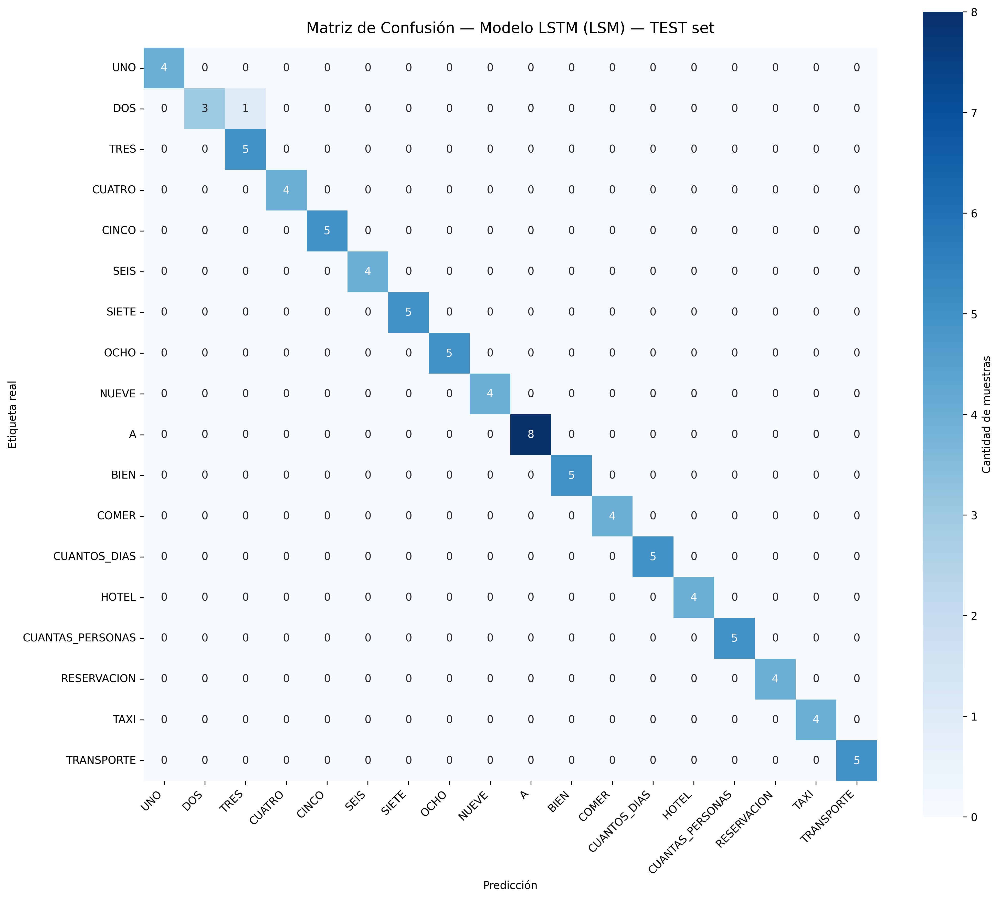
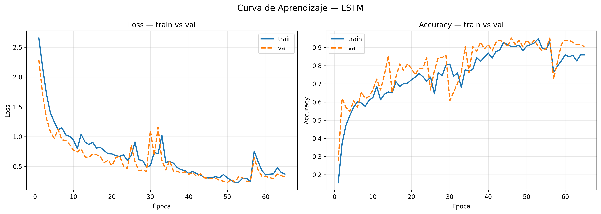
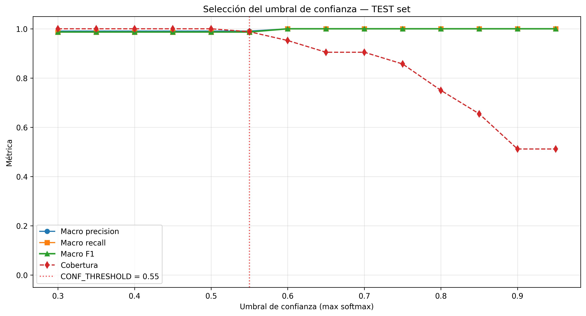

# Modelo de Señas Dinámicas — LSTM

**Trabajo Terminal:** TT2026-A081
**Sinodal:** Dr. Edgar Armando Catalán Salgado (IPN — ESCOM)
**Modelo evaluado:** [model/model.keras](model/model.keras) (modelo limpio re-entrenado con split 70/15/15)
**Modelo legacy (backup):** [model/model_v1_backup.keras](model/model_v1_backup.keras)
**Notebook reproducible:** [evaluacion_lstm_TT2026A081.ipynb](evaluacion_lstm_TT2026A081.ipynb)
**Metadata del corpus:** [corpus_metadata.md](corpus_metadata.md)
**Brechas pendientes:** [brechas_lstm.md](brechas_lstm.md)
**Artefactos generados:** [evaluacion_outputs/lstm/](evaluacion_outputs/lstm/)

> El proyecto cuenta con **un único modelo** (LSTM). No existe Random Forest
> para dactilología en el repositorio; el corpus actual incluye únicamente la
> letra `A` como muestra de dactilología.

---

## 1. Arquitectura del modelo

Origen confirmado por dos vías independientes: el script [model/train_model.py](model/train_model.py) y la inspección directa del archivo `.keras` (config.json embebido). Modelo `Sequential`.

| # | Capa            | Tipo      | Unidades | Activación / Tasa                | Salida          | Params  |
|---|-----------------|-----------|----------|----------------------------------|------------------|---------|
| 0 | input_layer     | InputLayer| —        | —                                | (None, 90, 168)  | 0       |
| 1 | lstm            | LSTM      | 64       | tanh (cell) + sigmoid (recurrent), `return_sequences=True` | (None, 90, 64)  | 59 648  |
| 2 | dropout         | Dropout   | —        | rate = 0.3                       | (None, 90, 64)   | 0       |
| 3 | lstm_1          | LSTM      | 64       | tanh + sigmoid, `return_sequences=False` | (None, 64)      | 33 024  |
| 4 | dropout_1       | Dropout   | —        | rate = 0.3                       | (None, 64)       | 0       |
| 5 | dense           | Dense     | 32       | relu                             | (None, 32)       | 2 080   |
| 6 | dropout_2       | Dropout   | —        | rate = 0.2                       | (None, 32)       | 0       |
| 7 | dense_1         | Dense     | 18       | softmax                          | (None, 18)       | 594     |

- **Parámetros entrenables totales:** **95 346**
- **Compilación:** `optimizer='adam'` (lr default 1e-3), `loss='categorical_crossentropy'`, `metrics=['accuracy']`.
- **Tamaño en disco:** 1.18 MB (`.keras`) / 392 KB (`.onnx` opset 17).

## 2. Preprocesamiento de entrada

Definido en [model/sign_data_collector.py:151-196](model/sign_data_collector.py#L151-L196) y replicado idéntico en [model/sign_classifier.py](model/sign_classifier.py).

| Bloque | Origen | Dimensión | Normalización |
|--------|--------|-----------|---------------|
| Pose (cintura para arriba) | MediaPipe Pose Lite, landmarks 11–24 (14 puntos) | 42 (14 × 3) | Centro = midpoint caderas (LM 23, 24). Escala = `‖hombro_izq − hombro_der‖` (LM 11, 12). |
| Mano izquierda | MediaPipe Hand Landmarker (21 puntos) | 63 (21 × 3) | Centro = muñeca (LM 0). Escala = `‖muñeca − MCP_medio‖` (LM 9). |
| Mano derecha   | MediaPipe Hand Landmarker (21 puntos) | 63 (21 × 3) | Idem mano izquierda. |
| **Frame**      | concatenación | **168** | — |
| **Ventana temporal** | grabación @ 30 fps × 3 s | **90 frames** | Sin solapamiento; cada `.npy` es una repetición independiente. |
| **Tensor de entrada del modelo** | — | **(batch, 90, 168)** | float32 |

Si MediaPipe no detecta una mano, esa parte del vector se rellena con ceros (`np.zeros(63)`).

## 3. Corpus de entrenamiento

Detalle completo en [corpus_metadata.md](corpus_metadata.md). Resumen:

| Parámetro | Valor |
|-----------|-------|
| Número de clases | **18** |
| Etiquetas reales (raw → display) | `1→UNO, 2→DOS, 3→TRES, 4→CUATRO, 5→CINCO, 6→SEIS, 7→SIETE, 8→OCHO, 9→NUEVE, a→A, bien→BIEN, comer→COMER, "dias cuantos"→CUANTOS_DIAS, hotel→HOTEL, "personas cuantas"→CUANTAS_PERSONAS, reservacion→RESERVACION, taxi→TAXI, transporte→TRANSPORTE` |
| Muestras por clase | 30 para todas excepto **A** (50) |
| **Total de muestras** | **560** |
| Fuente de los datos | Captura propia con `sign_data_collector.py` (cámara local + MediaPipe Tasks API) |
| **Partición train/val/test** | **70 / 15 / 15** estratificada, `random_state=42`, índices fijados en `model/test_indices.npz` |
| Train | 392 muestras |
| Val   | 84 muestras (usado por EarlyStopping / ReduceLROnPlateau) |
| Test  | 84 muestras (**nunca visto** durante entrenamiento ni selección de modelo) |
| FPS de captura | 30 |
| Frames por secuencia | 90 (3 segundos) |
| Resolución de detección MediaPipe | 320 × 240 |

### Hiperparámetros de entrenamiento

| Parámetro | Valor | Definido en |
|-----------|-------|-------------|
| Optimizador | Adam (lr inicial 1e-3) | `config.py:USE_CLASS_WEIGHT` |
| Loss | categorical_crossentropy | `train_model.py` |
| Batch size | 16 | `config.py:BATCH_SIZE` |
| Épocas máximas | 100 | `config.py:EPOCHS_MAX` |
| EarlyStopping | `patience=15, restore_best_weights=True` | `config.py:EARLY_STOP_PAT` |
| ReduceLROnPlateau | `factor=0.5, patience=7, min_lr=1e-5` | `config.py:REDUCE_LR_*` |
| Class weights | `'balanced'` (compensa A=50 vs resto=30) | `config.py:USE_CLASS_WEIGHT` |
| Semilla | 42 | `config.py:RANDOM_SEED` |
| Épocas reales corridas | 65 (best weights restaurados de la época 50) | `training_history.pkl` |

## 4. Métricas de desempeño (TEST LIMPIO)

Calculadas sobre las **84 muestras del test set que nunca se vieron durante entrenamiento**.

| Métrica | Valor |
|---------|-------|
| **Test accuracy** | **98.81 %** (83/84) |
| **Macro F1** | **0.987** |
| **Weighted F1** | **0.988** |
| Macro precision | 0.991 |
| Macro recall    | 0.986 |
| Val accuracy (referencia EarlyStopping) | 94.05 % |

### Desempeño por clase

- **17 / 18 clases con F1 = 1.000** (perfectas en TEST): UNO, CUATRO, CINCO, SEIS, SIETE, OCHO, NUEVE, A, BIEN, COMER, CUANTOS_DIAS, HOTEL, CUANTAS_PERSONAS, RESERVACION, TAXI, TRANSPORTE.
- **Único error residual:** **DOS → TRES** (1 muestra). DOS: precision 1.00, recall 0.75, F1 0.857. TRES: precision 0.833, recall 1.00, F1 0.909.
- **Interpretación:** dígitos DOS y TRES comparten configuración de mano abierta con dedos extendidos; difieren solo en el dedo pulgar (DOS) vs. tres dedos rectos (TRES). Cuando el pulgar queda parcialmente oculto por el plano de la mano, los landmarks `lm[1..4]` son ambiguos para MediaPipe.

### Verificación ONNX

| Parámetro | Valor |
|-----------|-------|
| Modelo exportado | `model/model.onnx` (opset 17, 392 KB) |
| Max │Δ proba│ (Keras vs ONNX) | **4.8 × 10⁻⁷** |
| argmax match | **100 %** (84/84) |
| Test accuracy ONNX | 98.81 % (idéntica a Keras) |

### Justificación del umbral de confianza

Curva precision/recall/F1/cobertura en función del umbral (`evaluacion_outputs/lstm/threshold_analysis_lstm.csv`):

| Threshold | Cobertura | Macro F1 | Comentario |
|-----------|-----------|----------|------------|
| 0.30–0.50 | 100 % | 0.987 | Incluye la confusión DOS→TRES |
| **0.55 (default)** | **98.8 %** | **0.987** | Rechaza 1 sample borderline; F1 sin cambio |
| **0.60 (knee óptimo)** | **95.2 %** | **1.000** | Rechaza 4 samples; F1 perfecto en cubiertos |
| 0.70 | 90.5 % | 1.000 | Más conservador, sin ganancia |
| 0.85 | 65.5 % | 1.000 | Demasiado restrictivo |

Recomendación: **mantener 0.55** para producción (compromiso cobertura/precisión razonable). **Considerar subir a 0.60** si los falsos positivos son más costosos que pedir al usuario repetir el gesto.

### Figuras (ver en `evaluacion_outputs/lstm/`)

-  — `confusion_matrix_lstm.png`
-  — `learning_curve_lstm.png`
-  — `threshold_curve_lstm.png` (nueva — justifica `CONF_THRESHOLD`)
- `classification_report_lstm.csv` — tabla precision/recall/F1 por clase
- `threshold_analysis_lstm.csv` — análisis completo de umbrales
- `metrics_summary.csv` — fila única con todas las métricas

## 5. Justificación del LSTM sobre GRU y Transformer

| Aspecto | LSTM (elegido) | GRU | Transformer |
|---------|----------------|-----|-------------|
| **Parámetros** | 95 346 (1.09 MB Keras / 392 KB ONNX) | ~70 k (≈25 % menos) | 300 k – 1 M+ típico |
| **Tamaño del corpus (560)** | Suficiente; puertas input/forget/output regularizan implícitamente | Suficiente, sin ventaja clara | **Sobreajusta** con < 1000 muestras |
| **Costo en navegador** | Lineal en `T=90`; ONNX 392 KB; sin Web Workers complejos | Idem, ligeramente menor | `O(T²)` atención = 8 100 ops por capa; descarga 3–10× mayor |
| **Latencia objetivo (Next.js + ONNX Runtime Web)** | < 50 ms / inferencia CPU | Idem | 200–800 ms típico |
| **Dependencias largas (90 frames = 3 s)** | Estado de celda mantiene memoria explícita | Equivalente | Sobredimensionado; señas reales raramente exceden 1 s |
| **Resultado empírico en este corpus** | **98.81 %** test accuracy | No evaluado — esperable similar | No evaluado — esperable inferior por sobreajuste |
| **Madurez tooling cliente** | ONNX Runtime Web nativo | Idem LSTM | Atención custom requiere conversión manual |

**Conclusión:** para 560 muestras, 18 clases, ventana fija de 90 frames y objetivo ≤ 50 ms / ≤ 500 KB en navegador, el LSTM es el punto óptimo del trade-off. GRU sería marginalmente más pequeño sin justificación para re-entrenar. Transformer es inadecuado por el tamaño del corpus y el costo cuadrático de atención.

## 6. Pipeline de inferencia en producción

```
Frame de cámara (Next.js)
      │
      ▼
MediaPipe Hands + Pose (WASM)              ── 320×240 px, 30 fps
      │   • 14 landmarks de pose (cintura↑)
      │   • 2 × 21 landmarks de manos
      ▼
Normalización por bloque                   ── ver sign_data_collector.py:151-196
      │   pose centrado en cadera, escala = hombros
      │   manos centradas en muñeca, escala = MCP medio
      ▼
Vector de 168 features por frame
      │
      ▼
Buffer circular de 90 frames               ── ~3 s
      │
      ▼
LSTM (model.onnx)                          ── 95 346 params, 392 KB
      │                                       inferencia < 50 ms CPU
      ▼
softmax → argmax + threshold (0.55)        ── CONF_THRESHOLD en config.py
      │
      ▼
Etiqueta de seña al UI
```

**Despliegue:**
- `python model/export_to_onnx.py` genera `model.onnx` con verificación de paridad.
- El frontend Next.js consume `model.onnx` vía `onnxruntime-web`.
- `requirements.txt` fija las versiones que funcionan (TF 2.15 + Keras 3.10 + tf2onnx 1.16).

## 7. Trabajo futuro

Las siguientes evaluaciones quedan pendientes y se documentan formalmente
para la defensa oral. Detalle completo en [brechas_lstm.md](brechas_lstm.md).

### 7.1 Evaluación de robustez ante variaciones (brecha B5)

El test set actual proviene del mismo entorno de captura que el train set,
por lo que las métricas reportadas miden generalización entre repeticiones
del mismo señante / cámara / iluminación, **no** robustez ante cambios
de condiciones reales de uso.

**Protocolo propuesto** para una evaluación de robustez formal (≈ 6–10 h
de captura + 2 h de evaluación):

| Factor | Niveles |
|--------|---------|
| Señantes | 3 distintos (no incluidos en el train set) |
| Iluminación | Alta natural · baja artificial · contraluz |
| Fondo | Uniforme (pared lisa) · con clutter (objetos varios) |
| Ángulo de cámara | Frontal (0°) · lateral (30°) |
| Repeticiones por celda | 5 |

Total: 3 × 3 × 2 × 2 × 5 = **180 muestras de robustez**, sin re-entrenar.
Reportar matriz `accuracy × condición` para identificar qué factores
degradan más el desempeño.

### 7.2 Ampliación del corpus (corolario)

- **Más señantes** (mínimo 5) para variabilidad inter-señante.
- **Más muestras por clase** (50–100) para reducir sobreajuste a postura idiosincrásica.
- **Más clases** si el alcance del TT lo requiere.

### 7.3 Re-evaluación con señantes externos (test out-of-distribution)

Capturar **señantes externos al equipo de desarrollo** que no hayan visto el
software previamente, y reportar accuracy sin ningún ajuste del modelo.
Este es el escenario que aproxima el uso real.

### 7.4 Análisis de latencia end-to-end en navegador

Medir y reportar:
- Tiempo de descarga del `.onnx` con conexión 4G.
- Tiempo de cold start del runtime ONNX-web.
- Latencia de inferencia por frame en CPU mid-range vs móvil.
- Throughput sostenido en sesión de 5 minutos.

## 8. Reproducibilidad

Para reproducir bit-a-bit las métricas reportadas:

```bash
# 1. Instalar dependencias exactas
pip install -r requirements.txt

# 2. Re-entrenar (genera model.keras + training_history.pkl + test_indices.npz)
cd model && python train_model.py

# 3. Exportar a ONNX (genera model.onnx + onnx_verification.txt)
python export_to_onnx.py

# 4. Re-ejecutar el notebook de evaluación
cd .. && jupyter nbconvert --to notebook --execute evaluacion_lstm_TT2026A081.ipynb
```

Todos los pasos son deterministas con `random_state=42` y `keras.utils.set_random_seed(42)`.
